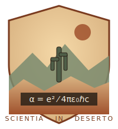

{.institute-crest fig-alt="Institute crest"}

::: {.epigraph}
"In the desert there is no time, only the running of the coupling."
— attributed to D. R. Caldera, founding director, 1974
:::

## About the Institute

The **Chuck Walla Institute of Advanced Physics** is an independent research center
in the Mojave devoted to perturbative and non-perturbative aspects of quantum
electrodynamics, low-energy effective theories, and the occasional cosmological
puzzle. Founded in 1974 by a small group of theorists in semi-retirement from
larger laboratories, the Institute publishes irregular *Notes & Preprints* and
hosts a quiet annual workshop in October.

## Recent Notes & Preprints

```{=html}
<!-- Listing handled on posts.qmd -->
```

See the full archive in [Notes & Preprints](posts.qmd).

## Visiting

The Institute occupies a small adobe compound 14 km west of Pahrump, Nevada.
Visitors are welcome by appointment; please bring water.
